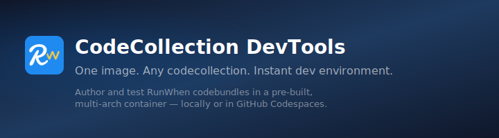

<div align="center">



# CodeCollection DevTools

**codecollection-devtools** is the standard development environment for authoring and testing [RunWhen](https://runwhen.com) codebundles. One image, any codecollection — pull the pre-built container, set an env var, and start developing.

[](https://github.com/runwhen-contrib/codecollection-devtools/actions/workflows/build-push.yaml)
[](https://opensource.org/licenses/Apache-2.0)

[GitHub](https://github.com/runwhen-contrib/codecollection-devtools) · [GHCR](https://github.com/orgs/runwhen-contrib/packages/container/package/codecollection-devtools) · [Author Docs](https://docs.runwhen.com/public/v/runwhen-authors/)

</div>

---

## Key features

- **One image for all codecollections** — set `CODECOLLECTION_REPO` to bootstrap any codecollection repo automatically.
- **PR review ready** — set `PR_NUMBER` and the environment checks out the PR branch for you.
- **Multi-arch** — pre-built for both `linux/amd64` (Codespaces, CI) and `linux/arm64` (Apple Silicon).
- **Batteries included** — Robot Framework, `ro` test runner, kubectl, Helm, AWS CLI, Azure CLI, gcloud, Terraform, gh CLI, and more.
- **Works everywhere** — GitHub Codespaces, VS Code devcontainers (local), or plain `docker run`.

## Requirements

- **Docker** or a compatible runtime (Podman, OrbStack, etc.) — for local devcontainer use
- **GitHub Codespaces** — no local runtime needed; runs in the cloud
- A codecollection repo to work on (defaults to `rw-cli-codecollection`)

## Getting started

### Option 1: GitHub Codespaces (recommended for PR review)

1. Go to **github.com/runwhen-contrib/codecollection-devtools** → **Code** → **Codespaces** → **New with options**
2. Pick your branch, region, and machine type → **Create codespace**
3. Once the terminal is ready, bootstrap your codecollection:

```bash
# defaults to rw-cli-codecollection on main
task setup

# specific repo + PR
task setup REPO=runwhen-contrib/rw-cli-codecollection PR=42

# different codecollection and branch
task setup REPO=runwhen-contrib/azure-c7n-codecollection BRANCH=feat/foo
```

That clones the repo, installs Python deps, installs authoring skills as Cursor rules, and checks out the PR branch if specified.

### Option 2: VS Code devcontainer (local)

Clone this repo and open it in VS Code with the Dev Containers extension:

```bash
git clone https://github.com/runwhen-contrib/codecollection-devtools.git
cd codecollection-devtools
```

Then open in VS Code → **Reopen in Container** (or `Cmd+Shift+P` → "Dev Containers: Reopen in Container").

The devcontainer pulls the pre-built image from GHCR — no local Docker build required.

Once inside the container, bootstrap your codecollection:

```bash
task setup REPO=runwhen-contrib/rw-cli-codecollection
```

#### Cursor with GitHub Codespaces

Use **Cursor** with a **Codespace** via **`gh codespace ssh`** and **Remote - SSH**. See **[Cursor + Codespaces + devcontainer](docs/cursor-remote-devcontainer.md)**.

### Option 3: Docker run (headless)

```bash
docker run --rm -it \
  -v "$HOME/.kube:/home/runwhen/auth/.kube:ro" \
  ghcr.io/runwhen-contrib/codecollection-devtools:latest \
  bash -c 'task setup REPO=runwhen-contrib/rw-cli-codecollection && exec bash'
```

---

## Task parameters

`task setup` accepts these variables:

| Variable | Default | Description |
|----------|---------|-------------|
| `REPO` | `runwhen-contrib/rw-cli-codecollection` | GitHub `org/repo` shorthand or full git URL of the codecollection. |
| `BRANCH` | `main` | Branch to check out after cloning. |
| `PR` | *(none)* | If set, checks out the PR branch via `gh pr checkout`. |

Other tasks: `task verify` (check tools), `task install-skills` (re-install skills), `task clean` (remove cloned codecollection).

## Environment variables

These are set in the container automatically:

| Variable | Default | Description |
|----------|---------|-------------|
| `GITHUB_TOKEN` | *(injected by Codespaces)* | GitHub token for `gh` CLI auth. Codespaces provides this automatically. |
| `RW_MODE` | `dev` | Set to `dev` for local development behavior (handled by `rw-core-keywords`). |

---

## Running codebundles

Once the environment is bootstrapped, navigate to any codebundle and use the `ro` wrapper:

```bash
cd codecollection/codebundles/k8s-namespace-healthcheck
ro runbook.robot
```

`ro` wraps the `robot` command with:
- **Isolated working directories** — each run gets its own temp dir with copied cloud CLI configs (`.azure`, `.gcloud`, `.kube`)
- **Log output** — HTML reports written to `/robot_logs`, served at [localhost:3000](http://localhost:3000)
- **Selective test execution** — `ro --test "Check Health" runbook.robot`

```bash
ro                              # run all .robot files in current dir
ro runbook.robot                # run a specific file
ro --test "Check Health"        # run a specific test case
ro ../other-codebundle/         # run tests in a different directory
```

### Credentials

Mount or copy credentials into the `auth/` directory:

```
/home/runwhen/
├── auth/
│   ├── .kube/config        # kubectl
│   ├── .azure/             # Azure CLI
│   └── .gcloud/            # Google Cloud SDK
├── codecollection/
│   ├── codebundles/        # your codebundles
│   └── libraries/          # shared keyword libraries
└── ro                      # test runner
```

`ro` copies these configs into an isolated temp directory per run, so parallel executions don't interfere with each other.

---

## CodeBundle authoring skills

The `skills/` directory contains platform-specific authoring guidance that is
automatically installed as [Cursor rules](https://docs.cursor.com/context/rules)
during `task setup`. These give AI assistants (and human authors) context about
generation rules, SLI patterns, and test infrastructure conventions.

| Skill | Covers |
|-------|--------|
| `generation-rules-kubernetes.md` | K8s resource types, match rules, qualifiers, templates |
| `generation-rules-aws.md` | AWS resource types, CloudQuery tables, account qualifiers |
| `generation-rules-azure.md` | Azure + Azure DevOps platforms, resource groups, subscriptions |
| `generation-rules-gcp.md` | GCP resource types, project qualifiers |
| `sli-authoring.md` | In-repo SLIs, cron-scheduler SLIs, scoring patterns |
| `test-infra-kubernetes.md` | Static manifests, Terraform patterns, Taskfile contract |
| `test-infra-azure.md` | Azure Terraform test infra, tf.secret, workspaceInfo |
| `test-infra-azure-devops.md` | DevOps projects, pipelines, agent pools via Terraform |
| `test-infra-cloud.md` | Shared conventions across all cloud platforms |

Skills are copied to `.cursor/rules/*.mdc` (the workspace root) at setup time. A
`.gitignore` is placed in that directory to prevent accidental commits. To
re-install after an update, run:

```bash
task install-skills
```

These same skills are used by the [CodeBundle Farm](https://github.com/runwhen/codebundle-farm)
Creator agent. Changes should be synced between both repos.

---

## What's in the image

| Category | Tools |
|----------|-------|
| **Core** | Python 3.x, Robot Framework, `ro`, `rw-core-keywords`, `rw-cli-keywords` |
| **Kubernetes** | kubectl, Helm, istioctl, kubelogin |
| **Cloud CLIs** | AWS CLI v2, Azure CLI, Google Cloud SDK (gcloud, gsutil, bq) |
| **Infrastructure** | Terraform, go-task |
| **Dev tools** | git, gh (GitHub CLI), sudo, jq |

### Python packages

Base packages installed in the image (from `requirements.txt`):

- `rw-cli-keywords` (includes `rw-core-keywords` — handles `RW_MODE=dev` for local development)
- `jmespath`, `python-dateutil`, `thefuzz`, `jinja2`

Each codecollection's `requirements.txt` is installed at bootstrap time by `task setup`.

---

## File structure

```
codecollection-devtools/
├── .devcontainer/
│   └── devcontainer.json       # devcontainer config (pulls pre-built image)
├── .github/
│   └── workflows/
│       ├── build-push.yaml     # CI: multi-arch build → GHCR + GCP Artifact Registry
│       └── pypi.yaml           # publish rw-devtools to PyPI (deprecated)
├── skills/                     # CodeBundle authoring skills (installed as Cursor rules)
│   ├── generation-rules-*.md   # Platform-specific generation rule guides
│   ├── sli-authoring.md        # SLI design and implementation guide
│   └── test-infra-*.md         # Test infrastructure patterns per platform
├── Taskfile.yml                # task setup, task verify, task install-skills, task clean
├── Dockerfile                  # image definition (built by CI, not locally)
├── ro                          # Robot Framework test runner wrapper
├── requirements.txt            # base Python dependencies
└── README.md
```

---

## Architecture

### Build pipeline

All image builds happen in **GitHub Actions** — never locally:

1. **Pull requests** → build test only (no push)
2. **Push to main** (when `VERSION`, `Dockerfile`, `requirements.txt`, `.devcontainer/**`, or workflow files change) → multi-arch build (`linux/amd64` + `linux/arm64`) → push to GHCR and GCP Artifact Registry

### Image registries

| Registry | Image |
|----------|-------|
| **GHCR** | `ghcr.io/runwhen-contrib/codecollection-devtools:latest` |
| **GCP Artifact Registry** | `us-docker.pkg.dev/runwhen-nonprod-shared/public-images/codecollection-devtools:latest` |

### Bootstrap flow

```
devcontainer opens
  → pulls pre-built image from GHCR
  → workspace root is /workspaces/codecollection-devtools/ (the repo mount)
  → starts log HTTP server on port 3000
  → user runs: task setup REPO=org/repo PR=123
      1. clones repo into /home/runwhen/codecollection/
      2. symlinks ./codecollection → /home/runwhen/codecollection
      3. checks out PR branch (if PR set)
      4. pip installs codecollection's requirements.txt
      5. installs skills/ as .cursor/rules/*.mdc (workspace root)
      6. verifies tools (ro, robot, kubectl, gh, python)
  → ready: cd codecollection/codebundles/<name> && ro
```

> **Two repos, one tree.** The workspace root is the devtools repo. The `codecollection/`
> directory is a symlink to a separate git clone. `git` commands inside `codecollection/`
> operate on the codecollection repo — not devtools. The `.gitignore` prevents the
> symlink from being tracked.

---

## For codecollection authors

Each codecollection repo does **not** need its own devcontainer config. Instead, point users at this repo:

```markdown
## Development

Use [codecollection-devtools](https://github.com/runwhen-contrib/codecollection-devtools)
to spin up a dev environment:

CODECOLLECTION_REPO=runwhen-contrib/your-codecollection

See the [devtools README](https://github.com/runwhen-contrib/codecollection-devtools#getting-started) for full instructions.
```

### Supported codecollections

Any codecollection that follows the standard layout works:

```
your-codecollection/
├── codebundles/
│   └── your-bundle/
│       ├── runbook.robot
│       └── sli.robot
├── libraries/
│   └── YourKeywords/
├── requirements.txt
└── README.md
```

---

## Contributing

We'd love to collaborate. Head to the [RunWhen author docs](https://docs.runwhen.com/public/v/runwhen-authors/codecollection-development/getting-started/running-your-first-codebundle) to get started with codebundle development.

---

## License

Apache-2.0
