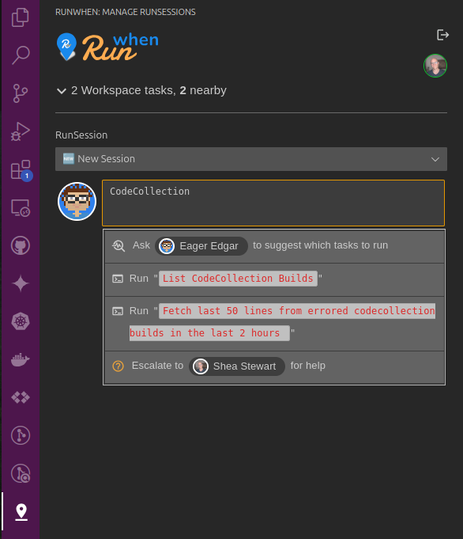

# CodeBundle Debugging

## CodeBundle Image Builds

When testing your CodeBundles in the RunWhen Platform, new commits made to yourCodeCollection repository trigger image builds within the Platform. These images can often take 10-20 minutes to complete, and during this time, SLXs using these CodeBundles will be running on an older version of your code.&#x20;

To assist with visibility and debugging of CodeBundle builds, Authors can be added to the **CodeCollection Authors** workspace in the RunWhen platform. This workspace provides tools for Authors to use when determining if an image is still building, if it has errored out, and so on. If you would like to be added to this workspace, or have a request for more troubleshooting tasks, please reach out through [Slack](https://runwhen.slack.com/join/shared_invite/zt-1l7t3tdzl-IzB8gXDsWtHkT8C5nufm2A#/shared-invite/email).&#x20;

<figure><figcaption>
CodeCollection Authors Workspace
</figcaption></figure>

### Using the VS Code Plugin

Authors can also interact with the **CodeCollection Authors** workspace through the RunWhen VS Code Plugin. The workspace will show up in the selector as  **CodeCollection Authors** or **runwhen-authors.**&#x20;

<figure><figcaption>
Listing available Tasks with the VS Code Plugin
</figcaption></figure>

<figure><figcaption>
Running a Task with the VS Code Plugin
</figcaption></figure>

