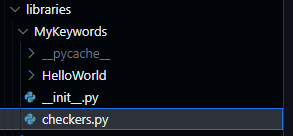

# Health Check a URL

This approach to checking if a URL is available and timley is demonstrated using a Python & Robot Framework oriented design. In this example we will create a starter codebundle that checks if a URL is available (returning HTTP 200) and has a response latency below a configurable threshold.

* First we write our python function which will be imported as a Robot Keyword; we'll place it in a python file called `checkers.py`

<figure><figcaption>
File Structure
</figcaption></figure>

* Here's the source code:

<figure><figcaption>
Python Keyword Source to check a URL
</figcaption></figure>

* And the Robot file itself:

<figure><figcaption>
HTTP Code Bundle
</figcaption></figure>

We can test this using the `ro` utility tool in the devtools container by running:

`ro runbook.robot`

Output:

<figure><figcaption>
HTTP Check Output
</figcaption></figure>

And we're done! From here you could look at examining the URL response more closely, provide more detailed output with differing report sections and formats for the platform and users.

Source: [https://github.com/runwhen-contrib/codecollection-template/tree/demo/codebundles/url-healthcheck](https://github.com/runwhen-contrib/codecollection-template/tree/demo/codebundles/url-healthcheck)
