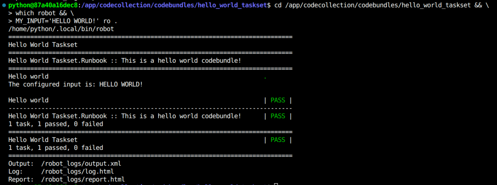

# Running Code Bundles With Configuration

This doc assumes you've already [created a CodeCollection and walked through running your first codebundle](running-your-first-codebundle.md). Visually we should see this output:

<figure><figcaption><p>Sample Hello World Code Bundle Pushing an SLI Metric of 1</p></figcaption></figure>

When running SLI Code Bundles, the red-highlighted section is the key part to look for as it indicates the SLI completed. The remainder of the output is typical robotframework test suite output.

In terms of drilling down into what's running, recall that the devtools has an always-on http server for us to browse log files at [http://localhost:3000/log.html](http://localhost:3000/log.html) (this url will differ for codespaces)

<figure><figcaption></figcaption></figure>

Woo! Congrats on running your first Code Bundle!

### Running A TaskSet With Variables


A TaskSet is a collection of tasks that can be run, collected together in a file named `runbook.robot`


Similar to the SLI, we'll run the TaskSest like so:

```bash
cd /app/codecollection/codebundles/hello_world_taskset && \
which robot && \
ro .
```

<figure><figcaption><p>A Hello World TaskSet</p></figcaption></figure>

Notice that when running a taskset the output is different than an SLI. This is a clear distinction between the outputs of the two codebundle types:

* An SLI collects data, calculates a metric and pushes it.
* A taskset can perform a variety of tasks like collecting information , performing triage, autohealing, etc, ending with an `Add To Report` command which adds the taskset output to a dataset for displaying to the end user. When a taskset is run on the platform, this output is organized into SRE reports on the frontend.

So how do we run codebundles with input? Well we already have technically, if you look at the [file contents](https://github.com/runwhen-contrib/codecollection-template/blob/main/codebundles/hello\_world\_taskset/runbook.robot#L10) of the taskset you'll see in the stanza on [line 15](https://github.com/runwhen-contrib/codecollection-template/blob/main/codebundles/hello\_world\_taskset/runbook.robot#L15) that the default value for this input is the string:

`default input value`

This matches what we saw in the report output. If we'd like to override this with our own input we can set an environment variable matching the input name and the devtools will use that value when importing the variable into the robot test suite:

```bash
cd /app/codecollection/codebundles/hello_world_taskset && \
which robot && \
MY_INPUT='HELLO WORLD!' ro .
```

Here we adhoc set the MY\_INPUT environment variable (you can also export it to maintain it for the shell session) for the run of the robot code, and we can see in our output:

<figure><figcaption><p>A taskset with input explicitly set</p></figcaption></figure>

### Devtools Configuration

The devtools container has various behaviours that can be adjusted using environment variables.

#### RW\_SVC\_URLS

Some keywords like `K8s` use location services to reduce binary/subprocess dependencies. In order to use a location service you'll want to set the following environment variable:

`RW_SVC_URLS='{"kubectl":"https://kubectl.sandbox.runwhen.com","oc":"https://oc.sandbox.runwhen.com","curl":"https://curl.sandbox.runwhen.com"}'`

Which can be added to your `.env` file.

#### RW\_FROM\_FILE

For some secrets you may wish to store them in files rather than wrestle with environment variables. The devtools container contains an `/app/auth/` directory appropriately gitignored for storing secret files in during development. In order to tell the devtools to use our secret files we need to provide a filename mapping:

`RW_FROM_FILE='{"MY_KUBECONFIG":"/app/auth/kubeconfig"}'`

This will tell the devtools to use the filecontents wherever it sees that environment variable name when importing them.

#### RW\_SECRET\_REMAP

If you're working with multiple similar secrets and wish to avoid constantly re-exporting them you can simply remap them by setting this environment variable:

`RW_SECRET_REMAP='{"kubeconfig":"MY_KUBECONFIG"}'`

This will cause all instances of `kubeconfig` to use `MY_KUBECONFIG` when the codebundle imports a secret called `kubeconfig`

#### RW\_ENV\_REMAP

Similar to the secret name remap, you can do the same for environment variables to avoid re-exporting them:

`RW_ENV_REMAP='{"PROMETHEUS_HOSTNAME":"PROM_HOSTNAME"}'`

### Next Steps

For next steps you'll want to run your new codebundles locally using `ro` as shown above and once you're happy with them simply push them to your codecollection repo we set up earlier. In order for you to run codebundles on the platform a RunWhen team member will have to do a one-time registration of your CodeCollection - feel free to tag us in the public Slack for this!
