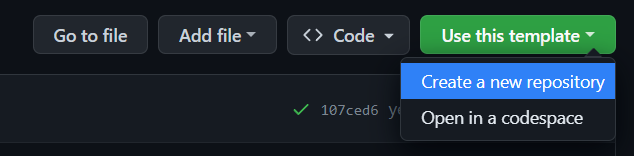
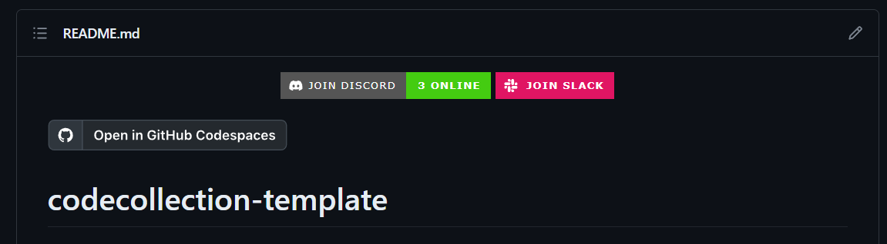
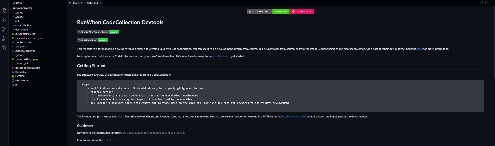
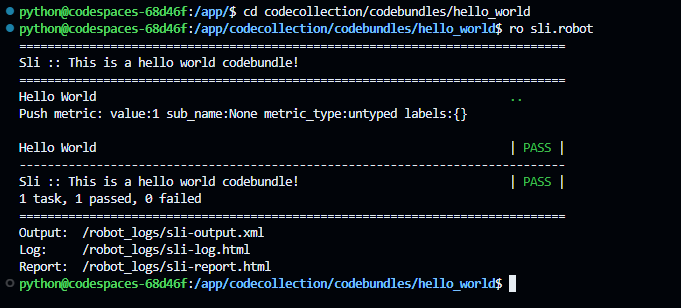
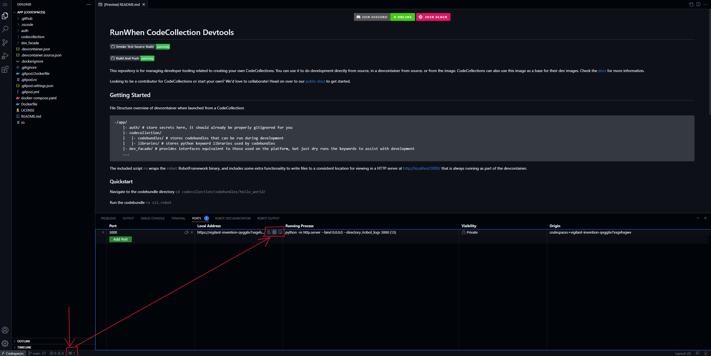
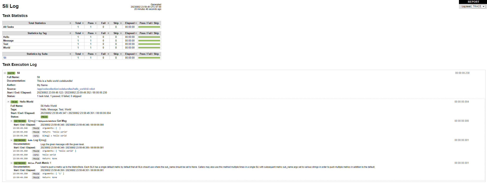

# Getting Started

## Repository Initialization

To get started, first create a CodeCollection for your first CodeBundle it reside in. Using the repository [template ](https://github.com/runwhen-contrib/codecollection-template)on GitHub, select the `Create a new repository` option from the `Use this template` dropdown.

<figure><figcaption><p>Template Setup</p></figcaption></figure>

### Launch it :rocket:

With your template created you'll be able to run it in codespaces. (or locally using the devcontainer VSCode plugin) On the readme of your new repository you'll see a badge titled `Open in GitHub Codespaces` - clicking that will start up a codespace for you.

<figure><figcaption><p>Readme</p></figcaption></figure>

You'll be greeted with a VSCode editor in your browser like this:

<figure><figcaption><p>vscode</p></figcaption></figure>

### Run it! :man\_running:

Running a codebundle is easy! There's a script`ro` in the devtools container that handles the complicated stuff for you, so we can run any robot file with`ro <robot filename>`

```
cd codecollection/codebundles/hello_world
ro sli.robot
```

<figure><figcaption><p>Hello World Code Bundle</p></figcaption></figure>

Success! Seeing a pass means the robot file completed without raising uncaught exceptions. You'll notice there's some log output as well. We can view them in a neat UI thanks to an HTTP server running in the devcontainer.

<figure><figcaption><p>Accessing the HTTP Server for Code Bundle Trace Logs</p></figcaption></figure>

Going to the authenticated URL, we can then view the robot logs which are nicely formated for us to browse:

<figure><figcaption><p>Viewing the Robot Trace Logs</p></figcaption></figure>

Congrats on running your first Code Bundle!


If you don't want to use VSCode or Codespaces, your new repo has a built image that you can develop in!


```
docker run -d -p 3000:3000 --name mycodecollection ghcr.io/<your_name>/<repo>:latest
```
